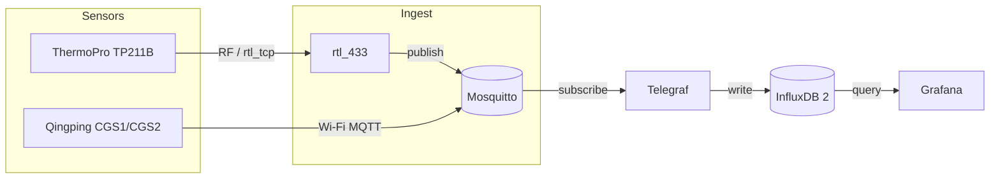

# Home Sensors

A Docker Compose stack for collecting, storing, and visualizing sensor data.

Currently includes:

* **rtl\_433** — SDR receiver for a ThermoPro TP211B temperature sensor, built from [a-rahimi/rtl\_433](https://github.com/a-rahimi/rtl_433)
* **Mosquitto** — MQTT broker for Qingping and other MQTT devices
* **Telegraf** — subscribes to MQTT, writes to InfluxDB
* **InfluxDB 2** — time-series database (4-year retention)
* **Grafana** — dashboards and interactive plots

Supported sensors: ThermoPro TP211B (via rtl\_433); Qingping air quality meter (e.g. CGS1/CGS2) via MQTT.



## Prerequisites

* Docker and Docker Compose
* An RTL-SDR USB dongle plugged in (for rtl\_433)
* **macOS only:** `librtlsdr` installed on the host (`brew install librtlsdr`)
* **Qingping:** The device and the host running Docker must be on the same network so the device can reach the host’s MQTT port (1883).

## Quick Start

### Edit credentials (optional but recommended)

```bash
nano ~/home-sensors/.env
```

Change `INFLUXDB_TOKEN`, `INFLUXDB_USERNAME`, and `INFLUXDB_PASSWORD` to something secure.

### Set up rtl\_tcp as a service (macOS)

Docker on macOS cannot access USB devices directly. Instead, `rtl_tcp`
runs natively and exposes the SDR dongle over TCP so the container can
reach it via `host.docker.internal:1234`.

Create a launchd agent so `rtl_tcp` starts automatically on login and
restarts if it crashes:

```bash
mkdir -p ~/Library/LaunchAgents

RTL_TCP_PATH="$(which rtl_tcp)"

cat > ~/Library/LaunchAgents/com.home-sensors.rtl-tcp.plist << EOF
```

<?xml version="1.0" encoding="UTF-8"?>

<!DOCTYPE plist PUBLIC "-//Apple//DTD PLIST 1.0//EN"
   "http://www.apple.com/DTDs/PropertyList-1.0.dtd">

<plist version="1.0">
<dict>
      <key>Label</key>
      <string>com.home-sensors.rtl-tcp</string>
      <key>ProgramArguments</key>
      <array>
         <string>${RTL_TCP_PATH}</string>
         <string>-a</string>
         <string>0.0.0.0</string>
      </array>
      <key>RunAtLoad</key>
      <true/>
      <key>KeepAlive</key>
      <true/>
      <key>StandardOutPath</key>
      <string>/tmp/rtl_tcp.log</string>
      <key>StandardErrorPath</key>
      <string>/tmp/rtl_tcp.log</string>
</dict>
</plist>
EOF

# Kill any existing rtl\_tcp process, then load the service

```bash
pkill rtl\_tcp || true
launchctl load ~/Library/LaunchAgents/com.home-sensors.rtl-tcp.plist
```

Manage the service with:

| Action | Command |
|---|---|
| Stop | `launchctl unload ~/Library/LaunchAgents/com.home-sensors.rtl-tcp.plist` |
| Start | `launchctl load ~/Library/LaunchAgents/com.home-sensors.rtl-tcp.plist` |
| Check status | `launchctl list \| grep rtl` |
| View logs | `tail -f /tmp/rtl_tcp.log` |

> **Note:** On Linux you can skip this step and use USB passthrough
> instead. See *Linux USB Passthrough* below.

### Start the stack

```bash
cd ~/home-sensors
docker-compose up -d --build
```

### Verify rtl\_433 is receiving data

For process output and errors: `docker-compose logs -f rtl_433`.

**Debug via HTTP:** rtl\_433 runs an HTTP API server on port 3001. Open <http://localhost:3001> in a browser to see a live view of decoded messages, device list, and stats. Use this to confirm the SDR → rtl\_433 path before checking InfluxDB.

**Stream readings (JSON):** To get a live stream of decoded events (one JSON object per line, CRLF), use the `/events` or `/stream` endpoint:

```bash
# Chunked stream (recommended; keep-alive every 60s)
curl -N http://localhost:3001/events

# Or with httpie (longer timeout so keep-alives don’t end the stream)
http --stream --timeout=70 localhost:3001/events
```

Each line is a JSON object with fields like `time`, `model`, `id`, `temperature_C`, `humidity`, etc.

You can also check if rtl\_433 is correctly reporting measurements to influxdb by querying influxdb:

```bash
source .env
docker-compose exec influxdb influx query \
  'from(bucket:"sensors") |> range(start: -1h) |> filter(fn: (r) => r._measurement == "ThermoPro-TP211B") |> limit(n: 5)' \
  --token "$INFLUXDB_TOKEN" --org home-sensors
```

If you see rows with `temperature_C` (and optional `humidity`), the pipeline is working.

### Open Grafana

Go to <http://localhost:3000>.
Default login: `admin` / `admin` (you'll be prompted to change the password).

The InfluxDB datasource is pre-configured.

### InfluxDB UI

The InfluxDB 2 web UI runs on port **3002**. Open <http://localhost:3002> in your browser and sign in with `INFLUXDB_USERNAME` and `INFLUXDB_PASSWORD` from `.env`. Use it to explore buckets, run Flux queries in the Data Explorer, and manage tokens.

### Create a dashboard

Use a Flux query like:

```flux
from(bucket: "sensors")
  |> range(start: -24h)
  |> filter(fn: (r) => r._measurement == "ThermoPro-TP211B")
  |> filter(fn: (r) => r._field == "temperature_C")
  |> map(fn: (r) => ({ r with _value: (r._value * 9.0 / 5.0) + 32.0, _field: "temperature_F" }))
```

## Qingping air quality meter (MQTT)

To log a Qingping air quality meter to InfluxDB and Grafana:

### Configure the device to use your MQTT broker

* Go to the [Qingping developer console](https://developer.qingping.co/privatisation/config) (register/login if needed).
* In **Private Access Config** → **Configurations**, create a new configuration.
* In **Self-built MQTT information**, set:
  * **Host:** your machine’s LAN IP (the host where Docker runs). Use an IP address, not a hostname—the device often does not resolve DNS names and will stay disconnected otherwise.
  * **Port:** `1883`
* In **Private Access Config** → **Device**, add your device (pair it first in the Qingping+ or Qingping IoT app), then assign this configuration to it.
* "Push" the configuration from the cloud UI.
* Update the MQTT configuration on the air monitor device under "Private Cloud".

### Verify

To see each message as it arrives:

```bash
docker-compose exec mosquitto mosquitto_sub -t 'qingping/#' -v
```

### Optional: shorter report interval

By default the Qingping meter may report only every 15 minutes. To switch to every 15 seconds you send one MQTT message from your computer to the broker; the meter listens on a “down” topic and applies the setting.

**Find your meter’s MAC address**\
Look this up on the device's "Private Cloud" panel, under "Private MQTT Setting". There, you'll see a topic like `qingping/A1:B2:C3:D4:E5:F6/up`. The MAC is `A1:B2:C3:D4:E5:F6`.

**Change the update interval**\
From the repo directory, run (replace `A1:B2:C3:D4:E5:F6` with your MAC):

```bash
docker-compose exec mosquitto mosquitto_pub -t 'qingping/A1:B2:C3:D4:E5:F6/down' -m '{"id":1,"need_ack":1,"type":"17","setting":{"report_interval":15,"collect_interval":15,"co2_sampling_interval":15,"pm_sampling_interval":15}}'
```

This causes your computer to send this one message to the Mosquitto broker; the Qingping meter is subscribed to its `.../down` topic and receives it, then updates its report interval. You only need to run this once (until the meter is reset or reconfigured).

### Querying InfluxDB directly

You can also browse and query InfluxDB in the [InfluxDB UI](#influxdb-ui): open <http://localhost:3002> (or <http://server.local:3002> on a remote host) and sign in with the credentials from `.env`.

### Grafana

* Telegraf parses the first `sensorData` element only and uses the device timestamp, so fields are **`co2_value`**, **`pm25_value`**, **`temperature_value`**, **`humidity_value`**, etc. (no array index in names). Measurement is **`qingping`**; use the **`topic`** tag to filter if you have multiple devices.
* Example Flux for CO₂ and PM2.5:

```flux
from(bucket: "sensors")
  |> range(start: -24h)
  |> filter(fn: (r) => r._measurement == "qingping")
  |> filter(fn: (r) => r._field == "co2_value" or r._field == "pm25_value")
```

The **`topic`** tag holds the MQTT topic (e.g. `qingping/582D34013D73/up`). Fields include **`co2_value`** (ppm), **`pm25_value`**, **`pm10_value`**, **`temperature_value`** (°C), **`humidity_value`** (%), **`battery_value`**, **`tvoc_value`**, and corresponding **`*_status`** fields. Filter by `r.topic == "qingping/YOUR_MAC/up"` if you have multiple devices.

### MQTT security settings

For production or exposed networks, consider enabling MQTT authentication in `mosquitto/config/mosquitto.conf` (e.g. password file and `allow_anonymous false`).

## Stopping / Restarting

```bash
cd ~/home-sensors

# Stop everything (data is preserved in Docker volumes)
docker-compose down

# Restart
docker-compose up -d
```

## Rebuilding rtl\_433

If the [a-rahimi/rtl\_433](https://github.com/a-rahimi/rtl_433) fork is updated:

```bash
cd ~/home-sensors
docker-compose build --no-cache rtl_433
docker-compose up -d rtl_433
```

## Deploying to a Remote Docker Host

You can build and run the stack on a remote machine by setting `DOCKER_HOST`. Docker will SSH into the remote host and execute everything there — no registry or image transfer needed.

```bash
export DOCKER_HOST=ssh://user@remote-host

# Build and start the full stack on the remote host
cd ~/home-sensors
docker-compose up -d --build
```

All `docker` and `docker-compose` commands in that shell session now run against the remote daemon.
